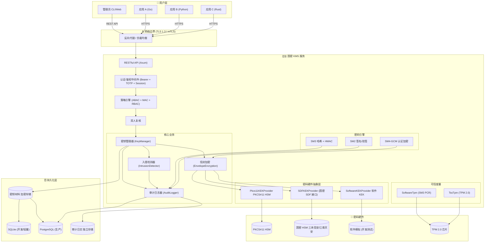
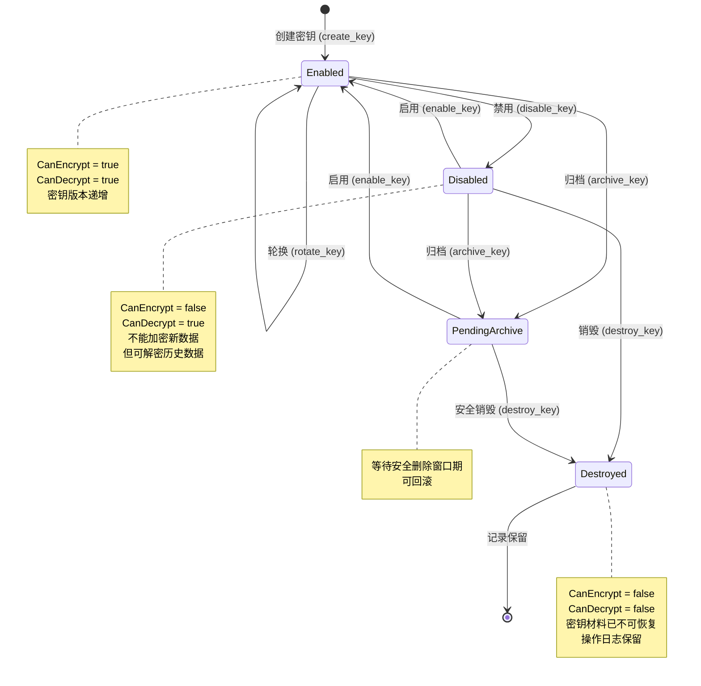
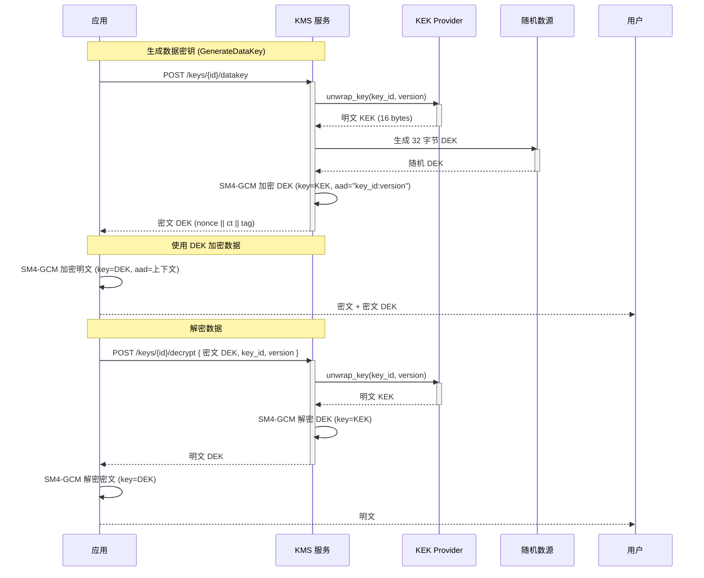
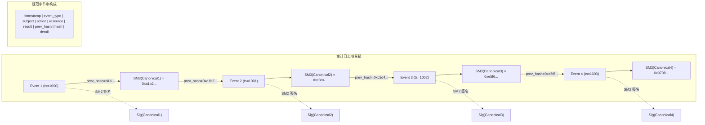

# KMS 架构设计文档

> 国密合规密钥管理系统 — Rust 实现
> 版本: 0.1.0

---

## 目录

- [1. 系统总体架构](#1-系统总体架构)
- [2. 模块架构](#2-模块架构)
- [3. 密钥生命周期](#3-密钥生命周期)
- [4. 信封加密流程](#4-信封加密流程)
- [5. 审计日志链](#5-审计日志链)
- [6. 等保合规对照](#6-等保合规对照)
- [7. 技术栈](#7-技术栈)
- [8. 目录结构](#8-目录结构)

---

## 1. 系统总体架构



### 架构要点

| 层级 | 职责 | 等保要点 |
|------|------|----------|
| **用户层** | 应用通过 HTTPS REST API 调用 KMS | 双向 TLS / mTLS 认证 |
| **网络边界** | TLS 1.3 终止，负载均衡 | 通信加密 (GB/T 22239-2019) |
| **KMS 核心** | 密钥管理、信封加密、审计日志、入侵检测、双人复核 | 密钥全生命周期 + 四权分立 |
| **密码引擎** | 国密算法 (SM2/SM3/SM4) | 国密算法合规 (GM/T 0002-2012 等) |
| **HSM 抽象** | 硬件密码设备热切换 | 密钥材料硬件保护 |
| **可信度量** | TPM 可信根 (PCR 度量) | 等保四级可信启动链 |
| **存储层** | 密钥密文存储 + 审计日志 | 数据加密存储 + 独立审计存储 |

---

## 2. 模块架构

```mermaid
graph TD
    subgraph API["api/ — HTTP 接口层"]
        routes["routes.rs 28+ 个 REST 路由"]
        middleware["middleware.rs 认证 + ABAC + TOTP"]
        mtls["mtls.rs mTLS Acceptor"]
        error["error.rs 统一错误响应"]
    end

    subgraph AuthMod["auth/ — 认证"]
        session["session.rs 会话管理"]
        totp["totp.rs TOTP 双因子 + 恢复码"]
    end

    subgraph Key["key/ — 密钥管理"]
        types["types.rs Key/KeyVersion/KeyState"]
        manager["manager.rs 生命周期控制"]
        store["store.rs KeyStore trait + Sqlite"]
        dependency["dependency.rs 密钥依赖关系"]
    end

    subgraph Crypto["crypto/ — 国密引擎"]
        traits["traits.rs SymmetricCrypto/HashEngine/SignEngine"]
        sm4["sm4_engine.rs SM4-GCM 认证加密"]
        sm3["sm3_engine.rs SM3 哈希 + HMAC"]
        sm2["sm2_engine.rs SM2 签名/验签 + 密钥对"]
        envelope["envelope.rs 信封加密 + 数据密钥"]
        secure_mem["secure_mem.rs 安全内存零化 + mlock"]
    end

    subgraph HSM["hsm/ — 硬件抽象"]
        traits_hsm["traits.rs KekProvider 接口"]
        sw_provider["software_provider.rs SM3-HMAC-KDF"]
        p11_provider["pkcs11_provider.rs PKCS#11 HSM"]
        sdf_provider["sdf_provider.rs SDF 兼容层"]
    end

    subgraph Policy["policy/ — 策略引擎"]
        types_pol["types.rs PolicyDocument/Statement"]
        engine_pol["engine.rs ABAC 评估"]
        label["label.rs MAC 安全标记"]
        roles_pol["roles.rs 三权分立 RBAC"]
    end

    subgraph Audit["audit/ — 审计日志"]
        logger["logger.rs SM3 链 + SM2 签名"]
        store_audit["store.rs 内存存储"]
        sqlite_audit["sqlite_store.rs SQLite 持久化"]
    end

    subgraph Monitor["monitor/ — 入侵检测"]
        detector["detector.rs 入侵检测器"]
        rules_mon["rules.rs 规则引擎"]
        blocklist["blocklist.rs 累进封禁"]
    end

    subgraph Trust["trust/ — 可信验证"]
        trust_mod["mod.rs 二进制+配置 SM3 校验"]
        tpm_sw["tpm/software_tpm.rs 软件 TPM 模拟"]
        tpm_hw["tpm/tss_tpm.rs TPM 2.0 硬件"]
    end

    subgraph Approval["approval/ — 双人复核"]
        approval_mod["mod.rs 审批请求 + SQLite 存储"]
    end

    subgraph Backup["backup/ — 备份恢复"]
        backup_mod["mod.rs 密钥/种子/审计导出导入"]
    end

    subgraph Evidence["evidence/ — 合规证据"]
        evidence_mod["mod.rs 合规报告 + 证据包"]
    end

    subgraph Store["store/ — 持久化"]
        repo["repository.rs KeyRepo + AuditRepo"]
        migrations["migrations.rs SQLite/PostgreSQL DDL"]
    end

    subgraph Config["config/ — 配置"]
        config_mod["config.rs TOML + CLI 参数"]
    end

    routes --> manager
    routes --> envelope
    routes --> logger
    routes --> engine_pol
    routes --> session
    routes --> totp
    routes --> backup_mod
    routes --> evidence_mod
    routes --> approval_mod
    routes --> blocklist
    middleware --> engine_pol
    middleware --> session
    middleware --> totp
    manager --> store
    manager --> sm3
    manager --> dependency
    envelope --> sm4
    envelope --> traits_hsm
    sm2 --> logger
    sm4 --> traits
    sm3 --> traits
    sm2 --> traits
    traits_hsm --> sw_provider
    traits_hsm --> p11_provider
    traits_hsm --> sdf_provider
    sw_provider --> sm4
    sw_provider --> sm3
    logger --> sm3
    logger --> sm2
    logger --> sqlite_audit
    store_audit --> sm3
    detector --> logger
    detector --> rules_mon
    detector --> blocklist
    trust_mod --> tpm_sw
    trust_mod --> tpm_hw
    store --> repo
    repo --> types
    config_mod --> error
```



### 模块依赖关系（自底向上）

```
config       →  基础设施配置
crypto       →  国密算法封装 (SM2/SM3/SM4)
hsm          →  密码硬件抽象 (软件/PKCS#11/SDF)
store        →  持久化存储 (SQLite/PostgreSQL)
  ├── key        →  密钥数据模型 + 生命周期管理
  ├── policy     →  ABAC + MAC + RBAC 策略引擎
  ├── audit      →  审计日志哈希链
  ├── auth       →  TOTP 双因子 + 会话管理
  ├── backup     →  备份恢复导出导入
  ├── monitor    →  入侵检测 + 累进封禁
  ├── trust      →  可信根验证 (SoftwareTpm / TssTpm)
  ├── approval   →  双人复核审批
  └── evidence   →  等保合规证据包
api          →  RESTful HTTP 接口 (Axum + mTLS)
main         →  依赖注入 + 服务启动
```

---

## 3. 密钥生命周期



### 关键规则

| 状态转换 | 条件 | 影响 |
|----------|------|------|
| `Enabled → Enabled` (轮换) | 自动/手动触发 | 创建新版本，历史版本保留用于解密 |
| `Enabled → Disabled` | 管理员操作 | 阻止新加密，允许解密已有数据 |
| `Disabled → PendingArchive` | 冷却期后自动 | 进入 30-90 天等待窗口 |
| `PendingArchive → Destroyed` | 窗口期满 | SM3 零化密钥材料，元数据保留 |
| `Destroyed` | 最终态 | 仅审计日志可查询，密钥不可恢复 |

---

## 4. 信封加密流程



### 设计要点

```
DEK (Data Encryption Key)
  ├── 长度: 32 字节 (256 bits)
  ├── 生成: CSPRNG (getrandom)
  ├── 使用: SM4-GCM 加密实际数据
  └── 保护: 被 KEK 包裹存储

KEK (Key Encryption Key)
  ├── 长度: 16 字节 (128 bits)
  ├── 派生: SM3-HMAC-KDF(master_seed, key_id, version)
  ├── 来源: 软件 KDF 或 HSM 内部生成
  └── 存储: HSM 内部 (硬件) 或 KDF 派生 (软件)

密文 DEK 格式: [nonce 12B] [ciphertext N B] [tag 16B]
```

---

## 5. 审计日志链



### 防篡改原理

```
伪造检测:
  1. 修改 Event N 的任意字段 → Sm3Hash 改变
  2. Event N 的 hash 字段不匹配 → 检测到篡改
  3. Event N+1 的 previous_hash != Event N 的 hash → 链断裂

完整性验证 (verify_chain):
  hash_ok(event)     = SM3(canonical(event)) == event.hash
  chain_ok(event)    = event.previous_hash == previous_event.hash
  integrity_pass     = ALL(hash_ok) AND ALL(chain_ok)

抗抵赖 (可选):
  event.signature    = SM2_SIGN(sk, SM3(canonical(event)))
  non_repudiation    = SM2_VERIFY(pk, SM3(canonical), signature)
```

---

## 6. 等保合规对照

### 等保三级覆盖

| 等保三级要求 | KMS 实现 | 状态 |
|-------------|----------|------|
| **身份鉴别** | Bearer Token + 双向 TLS + TOTP 双因子 | ✅ |
| **访问控制** | ABAC + MAC (Bell-LaPadula) + RBAC 三权分立 | ✅ |
| **安全审计** | SM3 哈希链 + SM2 签名 + 独立审计存储 | ✅ |
| **通信保密** | TLS 1.3 + mTLS 双向认证 + SM4-GCM 加密 | ✅ |
| **数据完整性** | SM3 哈希验证 | ✅ |
| **数据备份** | 密钥/种子/审计日志导出导入 | ✅ |
| **剩余信息保护** | zeroize 内存安全擦除 + mlock 内存锁定 | ✅ |
| **密码算法** | SM2/SM3/SM4 (libsm) | ✅ |
| **密码硬件** | PKCS#11 / 国密 SDF 接口 | ✅ |
| **密钥生命周期** | 全状态机管理 (创建→启用→禁用→归档→销毁) | ✅ |

### 等保四级增强

| 等保四级要求 | KMS 实现 | 状态 | 验证 |
|-------------|----------|------|------|
| **TPM 可信根** | SoftwareTpm (纯 Rust) + TssTpm (tss-esapi) | ✅ | `cargo test trust::tpm` |
| **硬件密码模块** | PKCS#11 cryptoki (SoftHSM 已验证) + 国密 SDF 兼容层 | ✅ | `--features pkcs11-hsm` |
| **入侵自动阻断** | 累进封禁 (base×2^strike, max 24h) + REST API | ✅ | `GET /api/v1/admin/blocklist` |
| **可信启动链** | 启动时 PCR 度量 (二进制 SM3 + 配置 SM3) | ✅ | 启动日志 PCR 度量输出 |
| **节点间通信** | ClusterConfig 框架 (mTLS + peer 发现) | ✅ | config.toml cluster 节 |
| **灾难恢复** | CLI 子命令 (export/import/backup/restore) | ✅ | RTO≤30min, RPO≤5min |
| **双人复核** | 审批请求机制 (ROTATE/ARCHIVE/DESTROY/EXPORT/IMPORT) | ✅ | `POST /api/v1/approvals` |
| **会话管理** | DashMap 内存会话 + TOTP 双因子 + 超时过期 | ✅ | `auth::session` 测试 |
| **内存保护** | zeroize + mlock (禁止换出) + 常量时间比较 | ✅ | `crypto::secure_mem` |

---

## 7. 技术栈

| 领域 | 技术 | 版本 |
|------|------|------|
| **编程语言** | Rust | 2021 edition |
| **HTTP 框架** | Axum | 0.7 |
| **异步运行时** | Tokio | 1.x |
| **数据库** | SQLx (SQLite / PostgreSQL) | 0.7 |
| **国密算法** | libsm (SM2/SM3/SM4) | 0.6 |
| **HSM 接口** | cryptoki (PKCS#11) | 0.6 (optional) |
| **序列化** | serde + serde_json | 1.x |
| **配置** | clap + toml | 4.x / 0.8 |
| **日志** | tracing + tracing-subscriber | 0.1 |
| **安全内存** | zeroize | 1.x |
| **并发容器** | dashmap + parking_lot | 5.x / 0.12 |

---

## 8. 目录结构

```
kms/
├── Cargo.toml              # 依赖管理 + feature flags
├── ARCHITECTURE.md          # ← 本文档
├── AGENTS.md               # AI 辅助开发指令
├── DESIGN.md               # 详细设计文档
├── README.md               # 项目简介
├── TESTING.md              # 测试指南
├── LEVEL4_COMPLIANCE.md    # 等保四级合规报告
├── config.toml             # 默认配置文件
├── data/                   # 数据目录 (gitignored)
├── deploy/                 # 部署脚本
├── diagrams/               # Mermaid 源文件
│   ├── system-architecture.mmd
│   ├── module-architecture.mmd
│   ├── key-lifecycle.mmd
│   ├── envelope-encryption.mmd
│   └── audit-chain.mmd
├── src/
│   ├── main.rs             # 服务入口 + 依赖注入
│   ├── lib.rs              # Error 类型 + IntoResponse
│   ├── config.rs           # 配置 (clap + toml)
│   ├── api/                # HTTP 接口层
│   │   ├── mod.rs          #   模块导出
│   │   ├── routes.rs       #   28+ REST 路由
│   │   ├── middleware.rs   #   认证 + ABAC + TOTP
│   │   ├── mtls.rs         #   mTLS Acceptor
│   │   └── error.rs        #   统一错误格式
│   ├── key/                # 密钥管理
│   │   ├── mod.rs          #   模块导出
│   │   ├── types.rs        #   数据结构
│   │   ├── manager.rs      #   生命周期控制
│   │   ├── store.rs        #   持久化实现
│   │   └── dependency.rs   #   密钥依赖关系
│   ├── crypto/             # 国密引擎
│   │   ├── mod.rs          #   模块导出
│   │   ├── traits.rs       #   接口定义
│   │   ├── sm4_engine.rs   #   SM4-GCM
│   │   ├── sm3_engine.rs   #   SM3 + HMAC
│   │   ├── sm2_engine.rs   #   SM2 签名
│   │   ├── envelope.rs     #   信封加密
│   │   └── secure_mem.rs   #   零化内存 + mlock
│   ├── hsm/                # 硬件抽象
│   │   ├── mod.rs          #   模块导出
│   │   ├── traits.rs       #   KekProvider 接口
│   │   ├── software_provider.rs  # 软件 HSM (SM3-KDF)
│   │   ├── pkcs11_provider.rs    # PKCS#11 HSM
│   │   └── sdf_provider.rs       # 国密 SDF 兼容层
│   ├── policy/             # 策略引擎
│   │   ├── mod.rs          #   模块导出
│   │   ├── types.rs        #   策略模型
│   │   ├── engine.rs       #   ABAC 评估
│   │   ├── label.rs        #   MAC 安全标记
│   │   └── roles.rs        #   三权分立 RBAC
│   ├── audit/              # 审计日志
│   │   ├── mod.rs          #   模块导出
│   │   ├── logger.rs       #   哈希链 + 签名
│   │   ├── store.rs        #   内存存储
│   │   └── sqlite_store.rs #   SQLite 持久化
│   ├── auth/               # 认证
│   │   ├── mod.rs          #   模块导出
│   │   ├── session.rs      #   会话管理 (DashMap)
│   │   └── totp.rs         #   TOTP 双因子 + 恢复码
│   ├── backup/             # 备份恢复
│   │   └── mod.rs          #   密钥/种子/审计导出导入
│   ├── monitor/            # 监控与入侵检测
│   │   ├── mod.rs          #   模块导出
│   │   ├── detector.rs     #   入侵检测器
│   │   ├── rules.rs        #   检测规则引擎
│   │   ├── blocklist.rs    #   累进封禁管理
│   │   ├── metrics.rs      #   Prometheus 指标
│   │   └── syslog.rs       #   Syslog 审计 (feature-gated)
│   ├── trust/              # 可信验证
│   │   ├── mod.rs          #   二进制/配置 SM3 校验
│   │   ├── tpm.rs          #   TPM trait + 类型
│   │   └── tpm/            #   TPM 实现
│   │       ├── software_tpm.rs # 软件 TPM 模拟 (SM3 PCR)
│   │       └── tss_tpm.rs      # TPM 2.0 硬件 (tss-esapi)
│   ├── approval/           # 双人复核
│   │   └── mod.rs          #   审批请求 + SQLite 存储
│   ├── evidence/           # 合规证据
│   │   └── mod.rs          #   合规报告 + 证据包导出
│   └── store/              # 持久化
│       ├── mod.rs          #   模块导出
│       ├── migrations.rs   #   建表 DDL
│       └── repository.rs   #   仓储实现
└── target/                 # 编译输出 (gitignored)
```

---

> **渲染说明**: 本文档中的 Mermaid 图表可在以下环境直接渲染：
> - **GitHub**: 原生支持 ` ```mermaid ` 代码块
> - **VS Code**: 安装 Markdown Preview Mermaid Support 插件
> - **CLI**: `npx @mermaid-js/mermaid-cli mmdc -i diagrams/*.mmd`
> - **Obsidian**: 内置 Mermaid 渲染器
>
> 独立 `.mmd` 文件位于 `diagrams/` 目录下。
